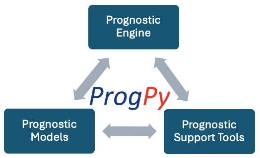
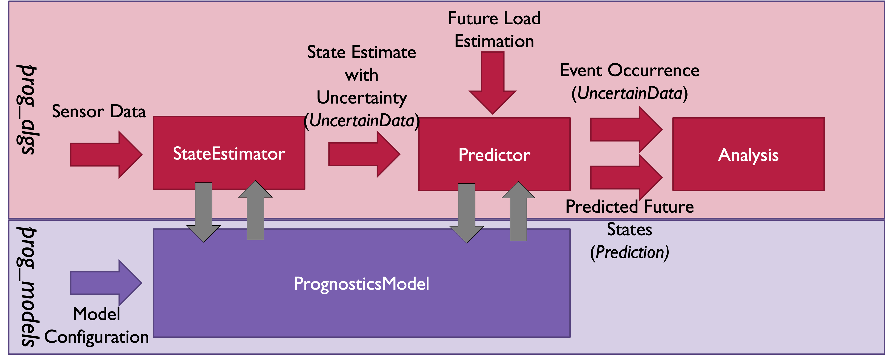

ProgPy Guide 
=============================================================

.. toctree::
   :maxdepth: 2
   :hidden:
   :glob:

   prog_models_guide
   prog_algs_guide
   prog_server_guide

The ProgPy framework consists of three key components that combine to create a flexible and extendible prognostics architecture.

1. 
    The **Prognostics Models** are the backbone of the ProgPy architecture. Models describe the specific system that prognostics will be applied to and how the system will evolve with time. Everything else within ProgPy (e.g. simulation capabilities and prognostics tools) are built on top of a model.

    ProgPy supports models that are physics-based, data-driven, or hybrid. ProgPy includes some built-in models (see examples below) but is also written in an easily adaptable way so users can implement models specific to their use-cases. 

2. 
    The **Prognostics Engine** encapsulates the complex logic of prognostics in a way that is modular and extendable. It includes the necessary tools to perform prognostics on the model, including state estimation, prediction, and uncertainty management. The modularity of the framework allows these capabilities to work with any model (built-in or user-defined) and the extensibility of the architecture allows users to additionally create their own methodologies. 

3. 
    The **Prognostics Support Tools** are a collection of capabilities to help users build new functionalities or understand prognostics results.

These three key components come together to create the comprehensive framework that is ProgPy. More details will be shared in the coming pages. 

This page is a general guide for ProgPy. To access a guide specific to the features you're using, select it in the menu below.

.. panels::
    :img-top-cls: pt-2, pb-2
    :header: text-center
    :body: text-center
    :column: col-lg col-lg col-lg

    ---
    :img-top: images/cube.png

    .. link-button:: Modeling and Sim Guide
        :type: ref
        :text: Modeling and Simulation
        :classes: stretched-link btn-outline-primary btn-block

    ---
    :img-top: images/Gear-icon.png

    .. link-button:: State Estimation and Prediction Guide
        :type: ref
        :text: State Estimation and Prediction
        :classes: stretched-link btn-outline-primary btn-block

    ---
    :img-top: images/Server_icon_CC0.svg.png

    .. link-button:: prog_server Guide
        :type: ref
        :text: prog_server
        :classes: stretched-link btn-outline-primary btn-block

What is Prognostics
------------------------------
ProgPy uses the following definition for :term:`prognostics`:

.. topic:: Prognostics

   Prediction of (a) future performance and/or (b) the time at which one or more events of interest occur, for a system or a system of systems

This is similar to definitions from [#Goebel2017]_. This approach is intended to be generic, capable of describing system behavior based on physical principles (i.e., physics-based), learning from data (i.e., data-based), or hybrid approaches (e.g., Physics-Informed Machine Learning). 

In general, the ProgPy prognostic approach is illustrated below. 

The foundation of prognostics is a :term:`model`. Models describe the behavior of a system or system of systems. A prognostics model specifically describes how the state of the system evolves with time. Prognostic models typically come in one of 4 categories: knowledge-based, :term:`physics-based<physics-based model>`, :term:`data-driven<data-driven model>`, or some combination of those three (i.e., hybrid).

Details on functionality for creation, simulation, and analysis of models can be found in the :ref:`Modeling and Simulation Guide <Modeling and Sim Guide>`. ProgPy also includes some example models and tools to access relevant data for model creation. 

ProgPy divides the prognostic process into two steps: :term:`state estimation<state estimator>` and :term:`prediction<predictor>`. State estimation is the process of determining the current system state (x), with some uncertainty, given the system parameters (:math:`\Theta`), system loading (u) and measurements (z). There are various methods used for this, such as Kalman Filters and Particle Filters. These methods utilize a prognostics model, comparing measurements (z) with those predicted from the system output equation.

In the prediction step, the state estimate at the prediction time and system model are used together to estimate system degradation with time. This is most commonly done using a variant of the Monte Carlo method with the model state transition equation. Prediction is often computationally expensive, especially for sample-based approaches with strict precision requirements (which therefore require large number of samples). ProgPy provides some potential solutions to combat this, such as :term:`surrogate` models, vectorization, and model configuration options.

Algorithms for :term:`state estimation<state estimator>` and :term:`prediction<predictor>` along with tools analyzing and visualizing results of state estimation and prediction, managing uncertainty, and creating new state estimators or predictors, see the :ref:`State Estimation and Prediction Guide<State Estimation and Prediction Guide>`.

More information
------------------------------

For more information, see the individual guides

.. panels::
    :img-top-cls: pt-2, pb-2
    :header: text-center
    :body: text-center
    :column: col-lg col-lg col-lg

    ---
    :img-top: images/cube.png

    .. link-button:: Modeling and Sim Guide
        :type: ref
        :text: Modeling and Simulation
        :classes: stretched-link btn-outline-primary btn-block

    ---
    :img-top: images/Gear-icon.png

    .. link-button:: State Estimation and Prediction Guide
        :type: ref
        :text: State Estimation and Prediction
        :classes: stretched-link btn-outline-primary btn-block

    ---
    :img-top: images/Server_icon_CC0.svg.png

    .. link-button:: prog_server Guide
        :type: ref
        :text: prog_server
        :classes: stretched-link btn-outline-primary btn-block

References
----------------------------

.. [#Goebel2017] Kai Goebel, Matthew John Daigle, Abhinav Saxena, Indranil Roychoudhury, Shankar Sankararaman, and Jos ́e R Celaya. Prognostics: The science of making predictions. 2017
