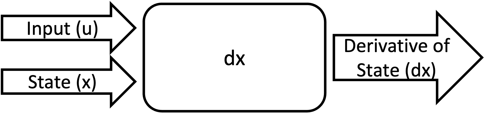

prog_models Guide
===================================================

.. raw:: html

    <iframe src="https://ghbtns.com/github-btn.html?user=nasa&repo=prog_models&type=star&count=true&size=large" frameborder="0" scrolling="0" width="170" height="30" title="GitHub"></iframe>

The Prognostics Models Package (prog_models) is a Python framework for defining, building, using, and testing models for :term:`prognostics` of engineering systems. It also provides a set of prognostics models for select components developed within this framework, suitable for use in prognostics applications for these components and can be used in conjunction with the Prognostics Algorithms Package (:ref:`prog_algs<prog_algs Guide>`) to perform research in prognostics methods. 

Installing prog_models
-----------------------

.. tabs::

    .. tab:: Stable Version (Recommended)

        The latest stable release of prog_models is hosted on PyPi. For most users (unless you want to contribute to the development of prog_models), the version on PyPi will be adequate. To install from the command line, use the following command:

        .. code-block:: console

            $ pip install prog_models

    .. tab:: Pre-Release

        Users who would like to contribute to prog_models or would like to use pre-release features can do so using the `prog_models GitHub repo <https://github.com/nasa/prog_models>`__. This isn't recommended for most users as this version may be unstable. To do this, use the following commands:

        .. code-block:: console

            $ git clone https://github.com/nasa/prog_models
            $ cd prog_models
            $ git checkout dev 
            $ pip install -e .

Getting Started 
------------------

.. image:: https://mybinder.org/badge_logo.svg
 :target: https://mybinder.org/v2/gh/nasa/prog_models/master?labpath=tutorial.ipynb

The best way to learn how to use prog_models is through the `tutorial <https://mybinder.org/v2/gh/nasa/prog_models/master?labpath=tutorial.ipynb>`__. There are also a number of examples that show different aspects of the package, summarized and linked in the below sections

ProgPy Prognostic Model Format
----------------------------------

Prognostics models are the foundation of the prognostics process. They describe how a system or system-of-systems is expected to behave based on how it is used/loaded (i.e., :term:`input`). Prognostic models typically come in one of 4 categories: knowledge-based, :term:`physics-based<physics-based model>`, :term:`data-driven<data-driven model>`, or some combination of those three (i.e., hybrid).

Inputs
^^^^^^^^^^^^^^^^^^^^^^^^

Prognostic model :term:`inputs<input>` are how a system is loaded. These are things that can be controlled, and affect how the system state evolves. The expected inputs for a model are defined by its *inputs* property. For example, a battery is loaded by applying a current, so the only input is *i*, the applied current. Inputs are also sometimes environmental conditions, such as ambient temperature or pressure. 

Inputs are one of the inputs to the state transition model, described in :ref:`States`

States
^^^^^^^^^^^^^^^^^^^^

ProgPy prognostic models are state-transition models. The internal :term:`state` of the system at any time is represented by one or more (frequently :term:`hidden<hidden state>`) state variables, represented by the custom type StateContainer. Each model has a discrete set of states, the keys of which are defined by the *states* property.

For example, the example ThrownObject model has two states, position (x) and velocity (v).

States are transitioned forward in time using the state transition equation. 

.. raw:: html

    

:math:`x(t+dt) = f(t, x(t), u(t), dt, \Theta)`

.. raw:: html

    

where :math:`x(t)` is :term:`state`, at time :math:`t`, :math:`u(t)` is :term:`input` at time :math:`t`, :math:`dt` is the stepsize, and :math:`\Theta` are the model :term:`parameters`.

In a ProgPy model, this state transition can be represented one of two ways, either discrete or continuous, depending on the nature of state transition. In the case of continuous models, state transition behavior is defined by defining the first derivative, using the :py:func:`prog_models.PrognosticsModel.dx` method. For discrete models, state transition behavior is defined using the :py:func:`prog_models.PrognosticsModel.next_state` method. The continuous state transition behavior is recommended, because defining the first derivative enables some approaches that rely on that information.

.. image:: images/next_state.png

.. dropdown::  State transition equation example

    An example of a state transition equation for a thrown object is included below. In this example, a model is created to describe an object thrown directly into the air. It has two states: position (x) and velocity (v), and no inputs.

    .. code-block:: python

        >>> def dx(self, x, u):
        >>>    # Continuous form
        >>>    dxdt = x['v']
        >>>    dvdt = -9.81  # Acceleration due to gravity
        >>>    return self.StateContainer({'x': dxdt, 'v': dvdt})

    or, alternatively

    .. code-block:: python

        >>> def next_state(self, x, u, dt):
        >>>    # Discrete form
        >>>    new_x = x['x'] + x['v']*dt
        >>>    new_v = x['v'] -9.81*dt  # Acceleration due to gravity
        >>>    return self.StateContainer({'x': new_x, 'v': new_v})

Output (Measurements)
^^^^^^^^^^^^^^^^^^^^^^^^^

The next important part of a prognostic model is the outputs. Outputs are measurable quantities of a system that are a function of system state. When applied in prognostics, generally the outputs are what is being measured or observed in some way. State estimators use the different between predicted and measured values of these outputs to estimate the system state. 

Outputs are a function of only the system state (x) and :term:`parameters` (:math:`\Theta`), as described below. The expected outputs for a model are defined by its *outputs* property. The logic of calculating outputs from system state is provided by the user in the model :py:func:`prog_models.PrognosticsModel.output` method.

.. image:: images/output.png

.. raw:: html

    

:math:`z(t) = f(x(t), \Theta)`

.. raw:: html
    
    

.. dropdown::  Output equation example

    An example of a output equation for a thrown object is included below. In this example, a model is created to describe an object thrown directly into the air. It has two states: position (x) and velocity (v). In this case we're saying that the position of the object is directly measurable. 

    .. code-block:: python

        >>> def output(self, x):
        >>>     # Position is directly measurable
        >>>     position = x['x']
        >>>     return self.OutputContainer({'x': position})

Events 
^^^^^^^^^^^^^^^^^^^^^^^^^^

Traditionally users may have heard the prognostic problem as estimating the Remaining Useful Life (RUL) of a system. ProgPy generalizes this concept with the concept of :term:`events<event>`. ProgPy Prognostic Models contain one or more events which can be predicted. Systems frequently have more than one failure mode, each of these modes can be represented by a separate event. For example, a valve model might have separate events for an internal leak and a leak at the input. Or a battery model might have events for insufficient capacity, thermal runaway, and low-voltage. 

Additionally, events can be used to predict other events of interest beyond failure, such as special system states or warning thresholds. For example, the above battery model might also have an warning event for when battery capacity reaches 50% of the original capacity because of battery aging with use.

The expected events for a model are defined by its *events* property. The logic of events can be defined in two methods: :py:func:`prog_models.PrognosticsModel.threshold_met` and :py:func:`prog_models.PrognosticsModel.event_state`.

:term:`Thresholds<threshold>` are the conditions under which an event occurs. The logic of the threshold is defined in the :py:func:`prog_models.PrognosticsModel.threshold_met` method. This method returns boolean for each event specifying if the event has occured. 

.. image:: images/threshold_met.png

.. raw:: html

    

:math:`tm(t) = f(x(t), \Theta)`

.. raw:: html
    
    

:term:`Event states<event state>` are an estimate of the progress towards a threshold. Where thresholds are boolean, event states are a number between 0 and 1, where 0 means the event has occured, 1 means no progress towards an event. Event states are a generalization of State of Health (SOH) for systems with multiple events and non-failure events. The logic of the event states is defined in the :py:func:`prog_models.PrognosticsModel.event_state` method.

.. image:: images/event_state.png

.. raw:: html

    

:math:`es(t) = f(x(t), \Theta)`

.. raw:: html
    
    

If threshold_met is not specified, threshold_met is defined as when event_state is 0. Alternately, if event_state is not defined, it will be 0 when threshold_met is True, otherwise 1. If a model has events, at least one of these methods must be defined

.. dropdown:: Event Examples

    An example of a event_state and threshold_met equations for a thrown object is included below. In this example, a model is created to describe an object thrown directly into the air. It has two states: position (x) and velocity (v). The event_state and threshold_met equations for this example are included below

    .. code-block:: python

        >>> def event_state(self, x):
        >>>     # Falling event_state is 0 when velocity hits 0, 1 at maximum speed
        >>>     falling_es = np.maximum(x['v']/self.parameters['throwing_speed'], 0)
        >>>
        >>>     # Impact event_state is 0 when position hits 0, 
        >>>     # 1 when at maximum height or when velocity is positive (going up)
        >>>     if x['v'] > 0:
        >>>         # Event state is 1 until falling starts
        >>>         x_max = 1
        >>>     else:
        >>>         # Use speed and position to estimate maximum height
        >>>         x_max = x['x'] + np.square(x['v'])/(-self.parameters['g']*2) 
        >>>     impact_es = np.maximum(x['x']/x_max,0)
        >>>     return {'falling': falling_es, 'impact': impact_es}
    
    .. code-block:: python

        >>> def threshold_met(self, x):
        >>>     return {
        >>>         'falling': x['v'] < 0,
        >>>         'impact': x['x'] <= 0
        >>>     }

Parameters
^^^^^^^^^^^^^^^

Parameters are used to configure the behavior of a model. For parameterized :term:`physics-based<physics-based model>` models, parameters are used to configure the general system to match the behavior of the specific system. For example, parameters of the general battery model can be used to configure the model to describe the behavior of a specific battery.

Models define a ``default_parameters`` property, that are the default parameters for that model. After construction, the parameters for a specific model can be accessed using the *parameters* property. For example, for a model `m`

.. code-block:: python

    >>> print(m.parameters)

Parameters can be set one of three ways: in model construction, using the *parameters* property after construction, or using Parameter Estimation feature (See :ref:`Parameter Estimation`). The first two are illustrated below:

.. code-block:: python

    >>> m = SomeModel(some_parameter = 10.2, some_other_parameter = 2.5)
    >>> m['some_parameter'] = 11.2  # Overriding parameter

The specific parameters are very specific to the system being modeled. For example, a battery might have parameters for the capacity and internal resistance. When using provided models, see the documentation for that model for details on parameters supported.

.. dropdown:: Derived parameters

    Sometimes users would like to specify parameters as a function of other parameters. This feature is called "derived parameters". See example below for more details on this feature. 

    * :download:`examples.derived_params <../../prog_models/examples/derived_params.py>`
                .. automodule:: derived_params

Noise
^^^^^^^^^^^

In practice, it is impossible to have absolute knowledge of future states due to uncertainties in the system. There is uncertainty in the estimates of the present state, future inputs, models, and prediction methods [#Goebel2017]_. This model-based prognostic approach incorporates this uncertainty in four forms: initial state uncertainty (:math:`x_0`), :term:`process noise`, :term:`measurement noise`, and :term:`future loading noise`.

.. dropdown:: Process Noise

    Process noise is used to represent uncertainty in the state transition process (e.g., uncertainty in the quality of your model or your model configuration :term:`parameters`).

    Process noise is applied in the state transition method (See :ref:`States`). 

.. dropdown:: Measurement Noise

    Measurement noise is used to represent uncertainty in your measurements. This can represent such things as uncertainty in the logic of the model's output method or sensor noise. 

    Measurement noise is applied in the output method (See :ref:`Output (Measurements)`).

.. dropdown:: Future Loading Noise

    Future loading noise is used to represent uncertainty in knowledge of how the system will be loaded in the future (See :ref:`Future Loading`). Future loading noise is applied by the user in their provided future loading method by adding random noise to the estimated future load.

See example below for details on how to configure proccess and measurement noise in ProgPy

* :download:`examples.noise <../../prog_models/examples/noise.py>`
    .. automodule:: noise

Future Loading
^^^^^^^^^^^^^^^^^^

Future loading is an essential part of prediction and simulation. In order to simulate forward in time, you must have an estimate of how the system will be used (i.e., loaded) during the window of time that the system is simulated. Future load is essentially expected :term:`inputs<input>` (see :ref:`Inputs`) at future times.

Future loading is provided to the user as a function of time and optional state. For example:

.. code-block:: python

    def future_load(t, x=None):
        # Calculate inputs 
        return m.InputContainer({'input1': ...})

See example below for details on how to provide future loading information in ProgPy. 

* :download:`examples.future_loading <../../prog_models/examples/future_loading.py>`
    .. automodule:: future_loading

General Notes
^^^^^^^^^^^^^^^^

Users of ProgPy will need a model describing the behavior of the system of interest. Users will likely either use one of the models distribued with ProgPy (see `Included Models <https://nasa.github.io/progpy/api_ref/prog_models/IncludedModels.html>`__), configuring it to their own system using parameter estimation (see :download:`examples.param_est <../../prog_models/examples/param_est.py>`), use a :term:`data-driven model` class to learn system behavior from data, or build their own model (see `Building New Models`_ section, below). 

Building New Models
----------------------

.. tabs::

    .. tab:: physics-based

        New :term:`physics-based models<physics-based model>` are constructed by subclassing :py:class:`prog_models.PrognosticsModel` as illustrated in the first example. To generate a new model, create a new class for your model that inherits from this class. Alternatively, you can copy the template :download:`prog_model_template.ProgModelTemplate <../../prog_models/prog_model_template.py>`, replacing the methods with logic defining your specific model. The analysis and simulation tools defined in :class:`prog_models.PrognosticsModel` will then work with your new model. 

        For simple linear models, users can choose to subclass the simpler :py:class:`prog_models.LinearModel` class, as illustrated in the second example. Some methods and algorithms only function on linear models.

        * :download:`examples.new_model <../../prog_models/examples/new_model.py>`
            .. automodule:: new_model

        * :download:`examples.linear_model <../../prog_models/examples/linear_model.py>`
            .. automodule:: linear_model

        .. dropdown:: Advanced features in model building

            * :download:`examples.derived_params <../../prog_models/examples/derived_params.py>`
                .. automodule:: derived_params

            * :download:`examples.state_limits <../../prog_models/examples/state_limits.py>`
                .. automodule:: state_limits

            * :download:`examples.events <../../prog_models/examples/events.py>`
                .. automodule:: events

    .. tab:: data-driven

        New :term:`data-driven models<data-driven model>`, such as those using neural networks, are created by subclassing the :py:class:`prog_models.data_models.DataModel` class, overriding the ``from_data`` method.
        
        The :py:func:`prog_models.data_models.DataModel.from_data` and :py:func:`prog_models.data_models.DataModel.from_model` methods are used to construct new models from data or an existing model (i.e., :term:`surrogate`), respectively. The use of these is demonstrated in the following examples.

        * :download:`examples.lstm_model <../../prog_models/examples/lstm_model.py>`
            .. automodule:: lstm_model
        
        * :download:`examples.full_lstm_model <../../prog_models/examples/full_lstm_model.py>`
            .. automodule:: full_lstm_model
        
        * :download:`examples.generate_surrogate <../../prog_models/examples/generate_surrogate.py>`
            .. automodule:: generate_surrogate

        .. dropdown:: Advanced features in data models

            * :download:`examples.custom_model <../../prog_models/examples/custom_model.py>`
                .. automodule:: custom_model

Wether you're using :term:`data-driven<data-driven model>`, :term:`physics-based<physics-based model>`, expert knowledge, or some hybrid approach, building and validating a model requires data. In the case of data-driven approaches, data is used to train and validate the model. In the case of physics-based, data is used to estimate parameters (see `Parameter Estimation`) and validate the model.

ProgPy includes some example datasets. See `ProgPy Datasets <https://nasa.github.io/progpy/api_ref/prog_models/DataSets.html>`_ and the example below for details. 

* :download:`examples.dataset <../../prog_models/examples/dataset.py>`
    .. automodule:: dataset

.. note:: To use the dataset feature, you must install the requests package.

Using provided models
----------------------------

ProgPy includes a number of predefined models in the :py:mod:`prog_models.models` module. These models are parameterized, so they can be configured to represent specific systems (see :ref:`Parameter Estimation`). 

For details on the included models see `Included Models <https://nasa.github.io/progpy/api_ref/prog_models/IncludedModels.html>`__. The examples below illustrate use of some of the models provided in the :py:mod:`prog_models.models` module.

* :download:`examples.sim <../../prog_models/examples/sim.py>`
    .. automodule:: sim

* :download:`examples.sim_battery_eol <../../prog_models/examples/sim_battery_eol.py>`
    .. automodule:: sim_battery_eol

* :download:`examples.sim_pump <../../prog_models/examples/sim_pump.py>`
    .. automodule:: sim_pump

* :download:`examples.sim_valve <../../prog_models/examples/sim_valve.py>`
    .. automodule:: sim_valve

* :download:`examples.sim_powertrain <../../prog_models/examples/sim_powertrain.py>`
    .. automodule:: sim_powertrain
        
* :download:`examples.sim_dcmotor_singlephase <../../prog_models/examples/sim_dcmotor_singlephase.py>`
    .. automodule:: sim_dcmotor_singlephase

Simulation
----------------------------

One of the most basic of functions using a model is simulation. Simulation is the process of predicting the evolution of system :term:`state` with time, given a specific :term:`future load` profile. Unlike full prognostics, simulation does not include uncertainty in the state and other product (e.g., :term:`output`) representation. For a prognostics model, simulation is done using the :py:meth:`prog_models.PrognosticsModel.simulate_to` and :py:meth:`prog_models.PrognosticsModel.simulate_to_threshold` methods.

.. role:: pythoncode(code)
   :language: python

.. dropdown:: Saving results

    :py:meth:`prog_models.PrognosticsModel.simulate_to` and :py:meth:`prog_models.PrognosticsModel.simulate_to_threshold` return the inputs, states, outputs, and event states at various points in the simulation. Returning these values for every timestep would require a lot of memory, and is not necessary for most use cases, so ProgPy provides an ability for users to specify what data to save. 

    There are two formats to specify what data to save: the ``save_freq`` and ``save_pts`` arguments, described below

    .. list-table:: 
        :header-rows: 1

        * - Argument
          - Description
          - Example
        * - ``save_freq``
          - The frequency at which data is saved
          - :pythoncode:`m.simulate_to_threshold(..., save_freq=10)`
        * - ``save_pts``
          - Specific times at which data is saved
          - :pythoncode:`m.simulate_to_threshold(..., save_pts=[15, 25, 33])`

    
    .. admonition:: Note
        :class: tip

        Data will always be saved at the next time after the save_pt or save_freq. As a result the data may not correspond to the exact time specified. Use automatic step sizes to save at the exact time.

.. dropdown:: Step size

    Step size is the size of the step taken in integration. It is specified by the ``dt`` argument. It is an important consideration when simulating. Too large of a step size could result in wildly incorrect results, and two small of a step size can be computationally expensive. Step size can be provided in a few different ways, described below:

    * *Static Step Size*: Provide a single number. Simulation will move forward at this rate. Example, :pythoncode:`m.simulate_to_threshold(..., dt=0.1)`
    * *Automatic Dynamic Step Size*: Step size is adjusted automatically to hit each save_pt and save_freq exactly. Example, :pythoncode:`m.simulate_to_threshold(..., dt='auto')`
    * *Bounded Automatic Dynamic Step Size*: Step size is adjusted automatically to hit each save_pt and save_freq exactly, with a maximum step size. Example, :pythoncode:`m.simulate_to_threshold(..., dt=('auto', 0.5))`
    * *Functional Dynamic Step Size*: Step size is provided as a function of time and state. This is the most flexible approach. Example, :pythoncode:`m.simulate_to_threshold(..., dt= lambda t, x : max(0.75 - t*0.01, 0.25))`

.. dropdown:: Integration Methods

    Simulation is essentially the process of integrating the model forward with time. By default, simple euler integration is used to propogate the model forward. Advanced users can change the numerical integration method to affect the simulation quality and runtime. This is done using the ``integration_method`` argument in :py:meth:`prog_models.PrognosticsModel.simulate_to_threshold` and :py:meth:`prog_models.PrognosticsModel.simulate_to`.

    For example, users can use the commonly-used Runge Kutta 4 numerical integration method using the following method call for model m:

    .. code-block:: python

        >>> m.simulate_to_threshold(future_loading, integration_method = 'rk4')

Use of simulation is described further in the following examples:

* :download:`examples.sim <../../prog_models/examples/sim.py>`
    .. automodule:: sim

* :download:`examples.noise <../../prog_models/examples/noise.py>`
    .. automodule:: noise

* :download:`examples.future_loading <../../prog_models/examples/future_loading.py>`
    .. automodule:: future_loading

* :download:`examples.dynamic_step_size <../../prog_models/examples/dynamic_step_size.py>`
    .. automodule:: dynamic_step_size

Parameter Estimation
----------------------------

Parameter estimation is an important step in prognostics. Parameter estimation is used to tune a general model to match the behavior of a specific system. For example, parameters of the general battery model can be used to configure the model to describe the behavior of a specific battery.

Sometimes model parameters are directly measurable (e.g., dimensions of blades on rotor). For these parameters, estimating them is a simple act of direct measurement. For parameters that cannot be directly measured, they're typically estimated using observed data. 

Generally, parameter estimation is done by tuning the parameters of the model so that simulation best matches the behavior observed in some available data. In ProgPy, this is done using the :py:meth:`prog_models.PrognosticsModel.estimate_params` method. This method takes :term:`input` and :term:`output` data from one or more runs, and uses scipy.optimize.minimize function to estimate the parameters of the model.

.. code-block:: python
    
    >>> params_to_estimate = ['param1', 'param2']
    >>> m.estimate_params([run1_data, run2_data], params_to_estimate, dt=0.01)

See the example below for more details

* :download:`examples.param_est <../../prog_models/examples/param_est.py>`
    .. automodule:: param_est

.. admonition:: Note
    :class: tip

    Parameters are changes in-place, so the model on which estimate_params is called, is now tuned to match the data

Visualizing Results
----------------------------

Results of a simulation can be visualized using the plot method. For example:

.. code-block:: python

    >>> results = m.simulate_to_threshold(...)
    >>> results.outputs.plot()
    >>> results.states.plot()

See :py:meth:`prog_models.sim_result.SimResult.plot` for more details on plotting capabilities

Other Examples
----------------------------

* :download:`examples.benchmarking <../../prog_models/examples/benchmarking.py>`
    .. automodule:: benchmarking

* :download:`examples.sensitivity <../../prog_models/examples/sensitivity.py>`
    .. automodule:: sensitivity

* :download:`examples.serialization <../../prog_models/examples/serialization.py>`
    .. automodule:: serialization

Tips
----
* If you're only doing diagnostics without prognostics- just define a next_state equation with no change of :term:`state` and don't perform prediction. The :term:`state estimator` can still be used to estimate if any of the :term:`events<event>` have occured.
* Sudden :term:`event's<event>` use a binary :term:`event state` (1=healthy, 0=failed).
* You can predict as many :term:`events<event>` as you would like, sometimes one :term:`event` must happen before another, in this case the :term:`event` occurance for event 1 can be a part of the equation for event 2 ('event 2': event_1 and [OTHER LOGIC]).

References
----------------------------

.. [#Goebel2017] Kai Goebel, Matthew John Daigle, Abhinav Saxena, Indranil Roychoudhury, Shankar Sankararaman, and José R Celaya. Prognostics: The science of making predictions. 2017

.. [#Celaya2012] J Celaya, A Saxena, and K Goebel. Uncertainty representation and interpretation in model-based prognostics algorithms based on Kalman filter estimation. Annual Conference of the Prognostics and Health Management Society, 2012.

.. [#Sankararaman2011] S Sankararaman, Y Ling, C Shantz, and S Mahadevan. Uncertainty quantification in fatigue crack growth prognosis. International Journal of Prognostics and Health Management, vol. 2, no. 1, 2011.
